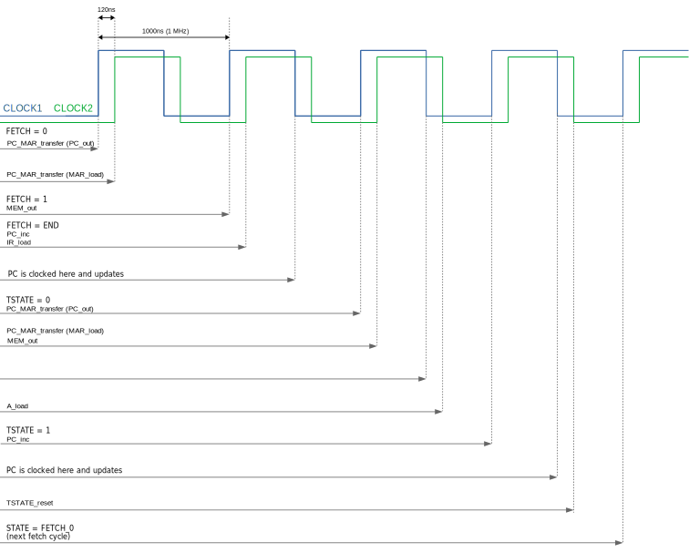

# Clock signals and timing

The clock module of the DM-02 generates a 1 MHz clock that is essentially split into two phases (*see: [Clock phases](#clock-phases)*)

There is no option for changing the clock speed (as opposed to what the DM-01 did), but there is a `CONTINUE` function that allows to resume program execution after a `HALT` instruction was executed.

There is also a *single-step mode* that allows the user to manually pulse the clock.


<a name="clock-phases"></a>
## Clock phases

The 1 MHz clock signal is split into 2 phases: CLOCK1 and CLOCK2.  
CLOCK2 is shifted *120ns* in comparison to CLOCK1 *(see: [Clock timing example](#timing-example))*

When something **output**s to the bus at rising CLOCK1, something else can **load** it at rising CLOCK2. 

The reason for this is that we need to take propagation delays of the logic gates and memory chips into account. For example: let's say that we set the address of our ROM chip and load the data from the chip into a register. In that case it actually takes some time for the data to be available and we have to wait with clocking the register until we know for certain that the data is there.

Propagation delays for most logic gates and registers that we use are 30ns maximum. The ROM chips however have more serious delays:

- W27C512-45Z (Program ROM): 45ns
- M27C1024-10F1 (Microcode ROM): 100ns
- M27C322-100F1 (ALU ROM): 100ns

So when fetching an instruction from memory, once we have set the address of the Microcode ROM, we need to wait 100ns until we can load the data into the Instruction Register.

<a name="timing-example"></a>

## Clock timing example

Let's take a look at how the controller fetches and executes an instruction to get a better idea of how the clock phases and timing works.

The instruction we are executing in this example is:

```
MOV A, #$FF    ; Transfer immediate hexadecimal value FF into the A register)
```

The (pseudo) microcode for this instruction looks like this:

```
FETCH:      PC_MAR_transfer  # The fetch cycle is hard-wired in the controller circuit
            IR_load
            MEM_out
            PC_inc

TSTATE_0:   PC_MAR_transfer  # Data micro instruction
            MEM_out	
            A_load
			
TSTATE_1:   PC_inc           # Misc. micro instruction
            TSTATE_reset
```

Now take a look at the clock signals and see when each of the control lines is activated.
The `STATE` changes indicate when the controller changes its state (i.e. what it is currently handling). It will first start the fetch cycle and then cycle through t-states (a.k.a. micro ticks).

