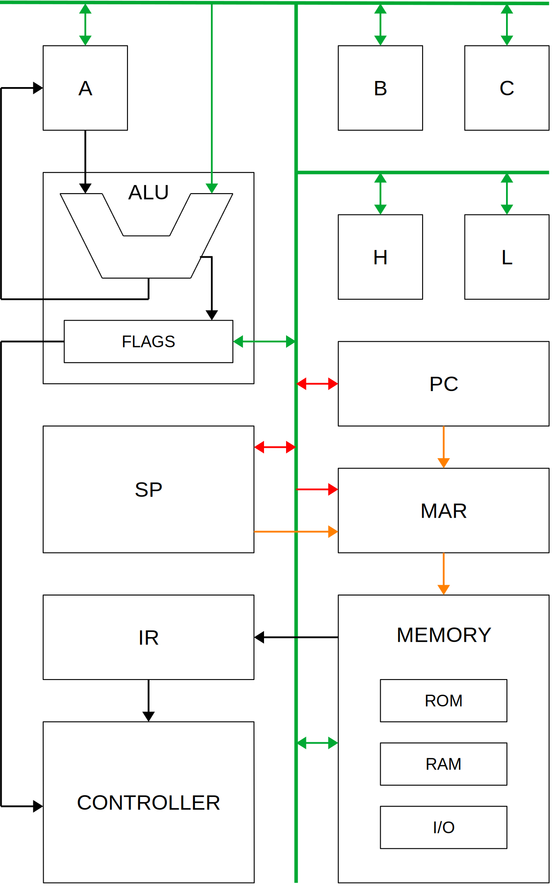

# DM-02 8-bit Computer

- [Introduction](#introduction)
- [Overall specifications](#overall-specifications)
- [High-level architecture](#high-level-architecture)
- [Documentation](#documentation)
- [Resources](#resources)

## Introduction

The DM-02 (*pronounced: “Dee Em Zero Two”*) is an 8-bit computer built (almost) entirely out of 7400-series (TTL) logic chips. It is the successor to my [74xx Computer](https://github.com/DutchMaker/TTL-computer) which from now on shall be refered to as DM-01.

Why is there a successor to the DM-01? Well, the main reason is that the DM-01 never got to be a fully functional computer. It worked in Logisim, but due to poor design from my end the actual electronics failed to function properly.
The DM-01 was the first computer I designed all by myself and I was learning how to do it while I was doing it. So naturally, mistakes have been made.
I’ve done quite a bit of research since then and decided to give it another go!
Instead of trying to fix the DM-01 I’ve taking all the lessons learned from my first attempt and start from the ground up (although some tooling will be reused).

## Overall specifications
DM-02 is (being) built with the following specifications in mind:

- At least 1 MHz clock speed
- Microcoded control unit
- 8-bit data bus
- 16-bit address bus, allowing for 64 Kb of addressable memory
  - 16 Kb reserved for ROM
  - 48 Kb reserved for RAM *(a 64 Kb RAM chip is used, but only the last 48 Kb can be addressed)*
- 16-bit stack pointer (entire RAM may be used as stack space)
- 16-bit program counter
- Register configuration:
  - 1x 8-bit accumulator (A)
  - 4x 8-bit general purpose registers (B, C, H, L)
  - BC and HL may be used as pair for 16-bit operations
- The ALU is based around an EPROM
- Supported flags: Zero, Carry, Negative, Overflow
- Flags may be pushed/popped onto/off the stack for use in JMP/CALL/RET instructions and for future interrupt support.
- I/O is addressable through memory and there are 256 addresses reserved for this
- Planned I/O modules:
  - Program loader (e.g., from SD card)
  - VGA card
  - Keyboard
- Modular design based on stackable PCBs
- One of these modules is the *Debugger*. This board attaches an Arduino Mega to the DM-02 and allows for:
  - Running hardware tests against each individual module.
  - Simulating the controller module and thus test the interaction between modules.
  - Debug the computer while it’s running programs.

## High-level architecture
The DM-02 architecture is based on a mix of elements found in the 6502, 8085, 6800 and 8088 processor architectures. The following schematic illustrates the high-level architecture of the DM-02.

*Green* lines are 8-bit data bus connections.  
*Red* lines are pairs of 8-bit connections to form a 16-bit value.  
*Orange* lines are 16-bit address lines.  
*Black* lines are internal bus connections.

## Documentation

Jump to detailed documentation on:

- [Clock signals and timing](./Clock-signals-timing.md)
- [Microcode architecture](./Microcode-architecture.md)
- [Assembly language reference](./Assembly-language.md)
- [ALU and Flags register](./ALU-and-flags.md)
- [Debugger module](./Debugger-module.md)
- [Notes on all the modules](./Modules.md)
- [Logisim instructions](./Logisim-Instructions.md)
- [Project status](./Project-status.md)

## External resources
It’s impossible to refer to every resource that helped me on the way, but a few stand out:

- [Digital Computer Electronics by Malvino & Brown](https://www.amazon.com/Digital-Computer-Electronics-Jerald-Malvino/dp/0074622358) (ISBN: 978-0-07-462235-3); This book has been a treasure of information! A must-have for every CPU enthusiast.
- [Ben Eater’s YouTube videos](https://www.youtube.com/user/eaterbc); His breadboard computer was the first computer I built and his videos are what got me into this whole thing
- [CSCvon8](https://github.com/DoctorWkt/CSCvon8) TTL computer; I've got a lot of inspiration from this project and the ALU ROM is taken from here.
- [Gigatron](http://gigatron.io) TTL computer
- The folks at Hackaday, Reddit and StackEchange

